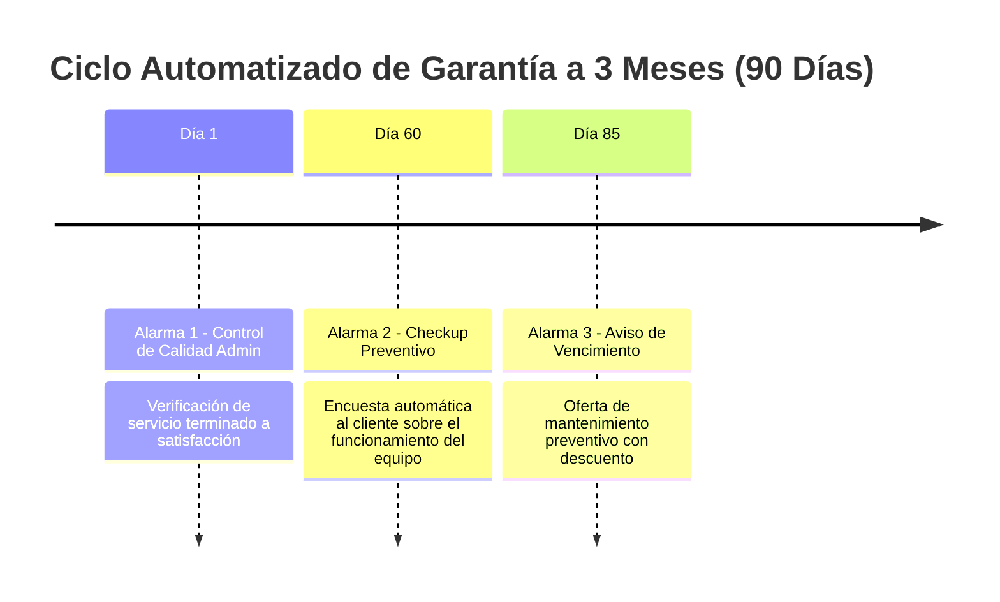

# Warranty Alarm Automation Engine Skill

Esta habilidad implementa la lógica del ciclo de post-venta y seguimiento de garantías de 3 meses para equipos de climatización y electrodomésticos.

## 1. Lógica de las 3 Alarmas



## 2. Estructura de la Tabla de Alarmas

```sql
CREATE TABLE alarmas_garantia (
    id SERIAL PRIMARY KEY,
    orden_id INT REFERENCES ordenes_servicio(id) ON DELETE CASCADE,
    tipo_alarma VARCHAR(30) NOT NULL, -- 'dia_1_calidad', 'dia_60_checkup', 'dia_85_vencimiento'
    fecha_programada DATE NOT NULL,
    estado VARCHAR(20) DEFAULT 'pendiente', -- 'pendiente', 'enviada', 'cancelada'
    created_at TIMESTAMP WITH TIME ZONE DEFAULT CURRENT_TIMESTAMP
);
```

## 3. Worker / Cron Job de Disparo Automático (Node.js)
```typescript
import cron from 'node-cron';

// Se ejecuta diariamente a las 8:00 AM
cron.schedule('0 8 * * *', async () => {
  const hoy = new Date().toISOString().split('T')[0];
  
  // 1. Consultar alarmas pendientes para hoy
  const alarmasPendientes = await getAlarmasParaFecha(hoy);
  
  for (const alarma of alarmasPendientes) {
    if (alarma.tipo_alarma === 'dia_1_calidad') {
      // Notificar a la secretaria en el panel administrativo
      await notificarSecretaria(alarma);
    } else if (alarma.tipo_alarma === 'dia_60_checkup') {
      // Enviar mensaje de checkup preventivo al WhatsApp del cliente
      await enviarMensajeWhatsAppCheckup(alarma);
    } else if (alarma.tipo_alarma === 'dia_85_vencimiento') {
      // Enviar recordatorio de fin de garantía y oferta de mantenimiento
      await enviarOfertaMantenimiento(alarma);
    }
    
    // 2. Marcar alarma como enviada
    await marcarAlarmaEnviada(alarma.id);
  }
});
```
